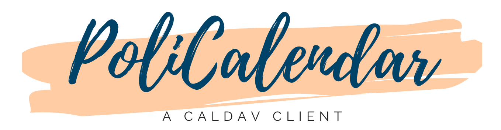
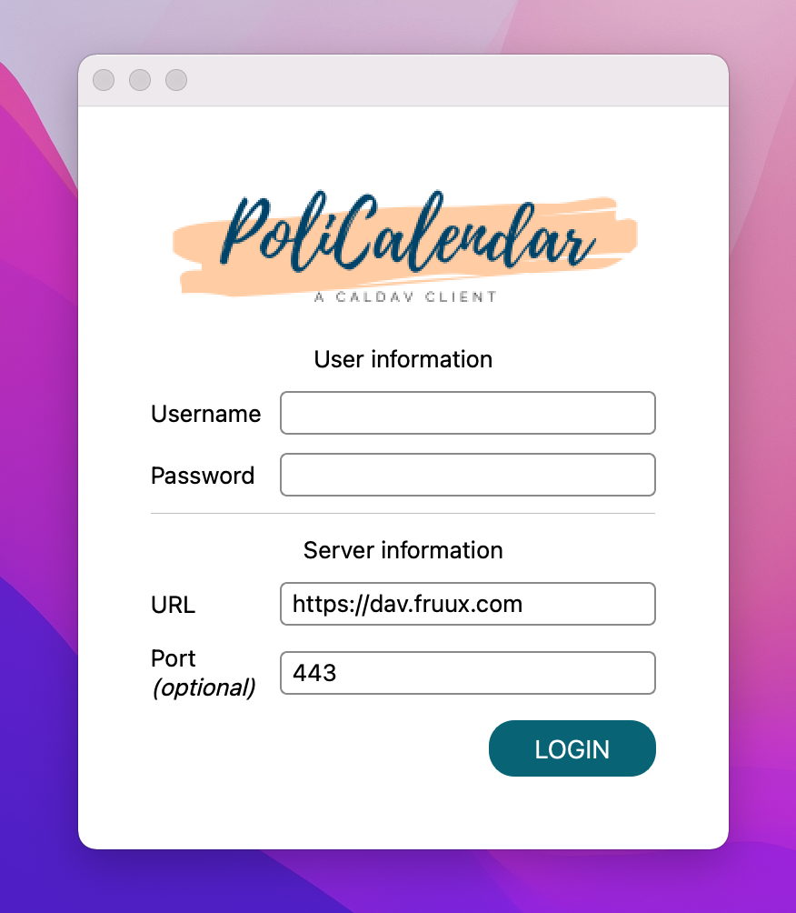
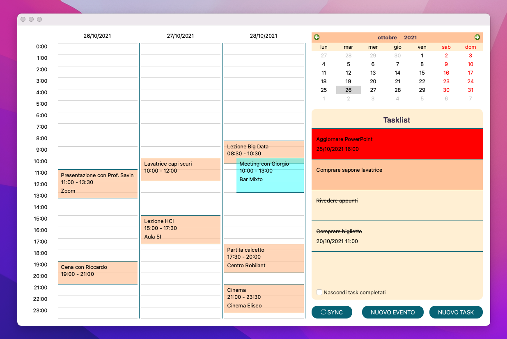
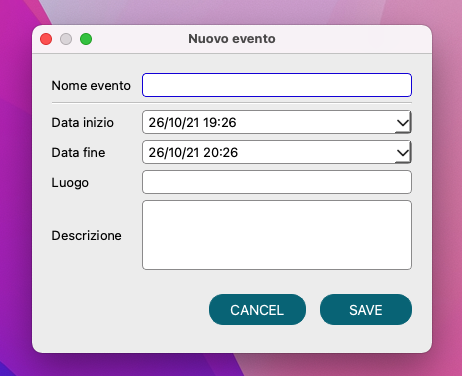
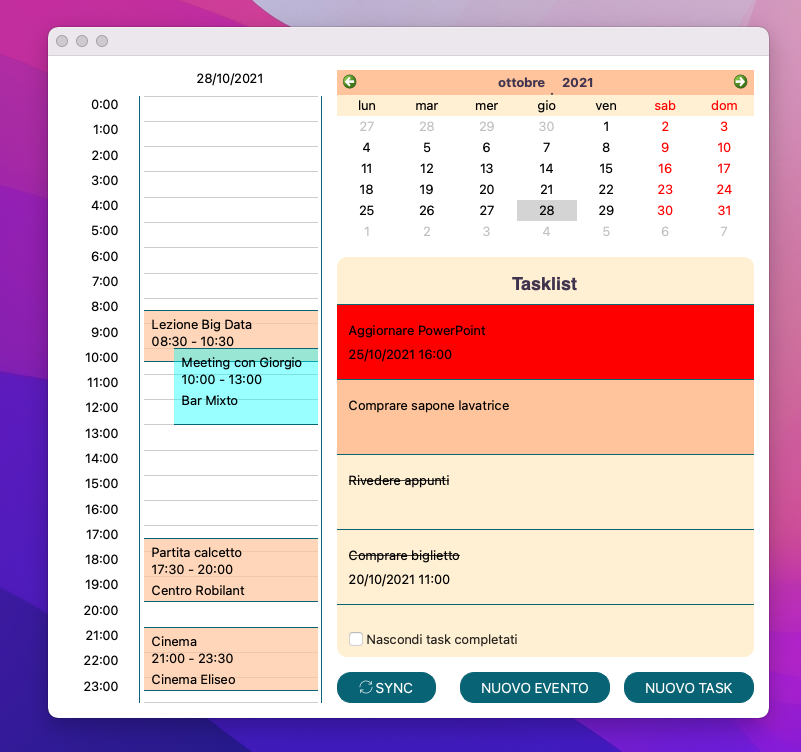

# PoliCalendar: a CalDAV client 

   

## Application goals
The primary aim of the project is to develop a C++ application capable of display and interact with a CalDAV server (ex: saber / dav, Nextcloud, etc.), providing a graphical interface that supports the integration of both calendar and to-do list in the same space.  The application is based on the C++ GUI library called QT.  For the development of the project, CMake was used for the entire deployment chain. Attention has been paid to the asynchrony and parallelization needed by the problem.  Indeed, to allow user interaction with calendars and tasks (creation / modification / cancellation of the same), the nature of the problem requires to synchronize information with the server in order to support, among other possibilities, the sharing of a single calendar/task list among multiple users.

## Features’ description 

    
  <em>Login form to authenticate with the server. </em>

When the application is launched, it’s possible to enter the necessary data for connection with a CalDAV server, including:
- username
- password
- server URL
- port
Both http and https connections are supported.

   
  <em>Main screen showing the events on the calendar and the task list. </em>

Once logged in, the calendar related to the user will be downloaded and therefore its events and tasks. 

   
  <em>Pop-up to add a new event. </em>

The user can add new events or tasks, delete them, modify them and synchronize, for any online changes, again with the server.

Through the monthly calendar you can quickly choose a date to show the related events. 

   
  <em>One-column view of the app. </em>

The graphic interface can be rescaled to display one or more columns representing a date. Overlapping events are shown with attention to visibility.

Particular attention has also been paid to the management of errors with the server, both in the login phase and in the download of new data and to the parallelism during the download of events and tasks.

## Technical features: used libraries 
### Front-end development 
- QT: multiplatform library to develop programs with a graphical interface through the use of widgets. (www.qt.io)

### Back-end development
- NEON: High-level wrapper for HTTP operations (GET, MOVE, DELETE, etc.) and also low-level, through the HTTP request/response engine, which allows the use of specific CalDAV headers and methods. Also support for authentication including Basic and Digest;  wrapper for PROPFIND and PROPPATCH to simplify the manipulation of properties (github.com/notroj/neon)
- PugiXML: Extremely fast XML parser capable to build the DOM tree from an XML file /buffer (github.com/zeux/pugixml)
- LibiCAL: implementation of the iCalendar/CalDAV protocols making sure that the calendar client can communicate with the servers allowing users to store their calendar data and organize meetings with other users. Implement RFC5545, RFC5546, RFC7529.  (github.com/libical/libical)

## Credits 
This application was developed for the “Programmazione di sistema” course held by professor Alessandro Savino at Politecnico di Torino. This was also built with the collaboration of my colleagues Mengoli R. And Pierro M. from the same course. 
This project was awarded with the maximum score allowed. 

